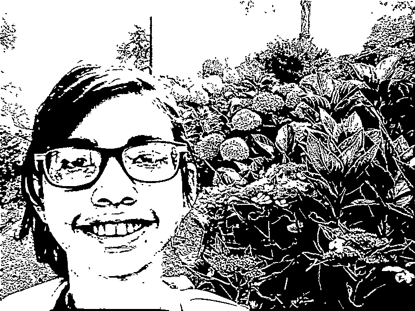

--- 
title: "About Punto"
date: 2018-11-27T20:19:09-06:00
draft: true
---
The name... Well, why is Punto Craft called Punto you may be wondering? It is because punto means stitch in Italian and that is what Punto Craft is all about. 

Hello! I'm Lucy Caples, founder of Punto in 2018. I've been a crafter For as long as I can remember! I have tried many, many crafts but embroidery really stuck with me.
